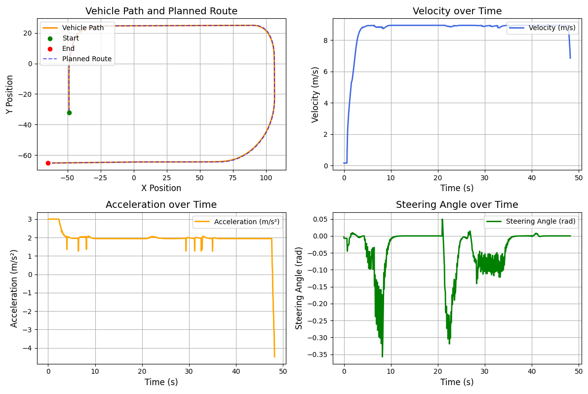

# 自动驾驶车辆轨迹跟踪

## 项目概述
本项目实现了基于模型预测控制（Model Predictive Control, MPC）的车辆控制系统，集成于CARLA自动驾驶模拟环境中。该系统能够实现精确的路径跟踪控制，同时通过调整控制参数可以获得更平滑的横向转向表现。

## 项目参考资料

本项目在设计与实现过程中，借鉴了以下两个开源项目，分别对应 **Simple**（简化版控制）与 **Strong**（完整 MPC 控制）两种策略：

### 🔹 Simple（简化控制版本）

- **控制公式推导**：  
  [Carla 中车辆避障与轨迹跟踪的 MPC 原理（知乎）](https://zhuanlan.zhihu.com/p/525523586)

- **代码实现参考**：  
  [gustavomoers/CollisionAvoidance-Carla-DRL-MPC](https://github.com/gustavomoers/CollisionAvoidance-Carla-DRL-MPC)

### 🔹 Strong（完整模型预测控制）

-  **基于动态模型的 MPC 跟踪控制（含APF）**：  
  [henryhcliu/udmc_carla](https://github.com/henryhcliu/udmc_carla.git)

> 💡 说明：本项目仅借鉴该版本中的 **车辆对道路路线的 MPC 跟踪控制** 部分，**去除了 APF（人工势场）路径避障**相关模块，以简化系统结构，聚焦于基础跟踪控制任务。

## 🌲Carla演示

https://github.com/user-attachments/assets/1162bb94-ba36-4016-a4c4-fb11cef6d598

## 结果演示
<p align="center">
  
</p>

## 系统特点

- **MPC 轨迹跟踪**  
  滚动优化控制，显式约束加速度/转角/变化率，输出平滑、可控的控制量。并加入jerk约束使得轨迹更加平滑。

- **路径与速度生成**  
  三次样条构造参考路径，结合最近点匹配与目标速度曲线实现稳定跟踪。

## 环境要求
- Python 3.7+
- CARLA 0.9.14+

## 使用方法
1. 启动carla模拟器
   ```bash
   cd path/to/carla
   ./CarlaUE4.exe -windowed -ResX=800 -ResY=600
   ```
2. 运行strong MPC控制器
   ```bash
   cd PythonAPI/examples/carla_MPC
   pip install -r requirements.txt
   python test_main.py  # 默认为spec模式
   ```
3. 运行simple控制器
   ```bash
   cd version_simple
   python MPCMPCController.py # 可能路径存在问题，需要自行调整
   ```

## 注意事项
若电脑性能有限，建议改用 spec 模式（Carla 内置无渲染视角），可彻底避免 Pygame 带来的画面卡顿。
